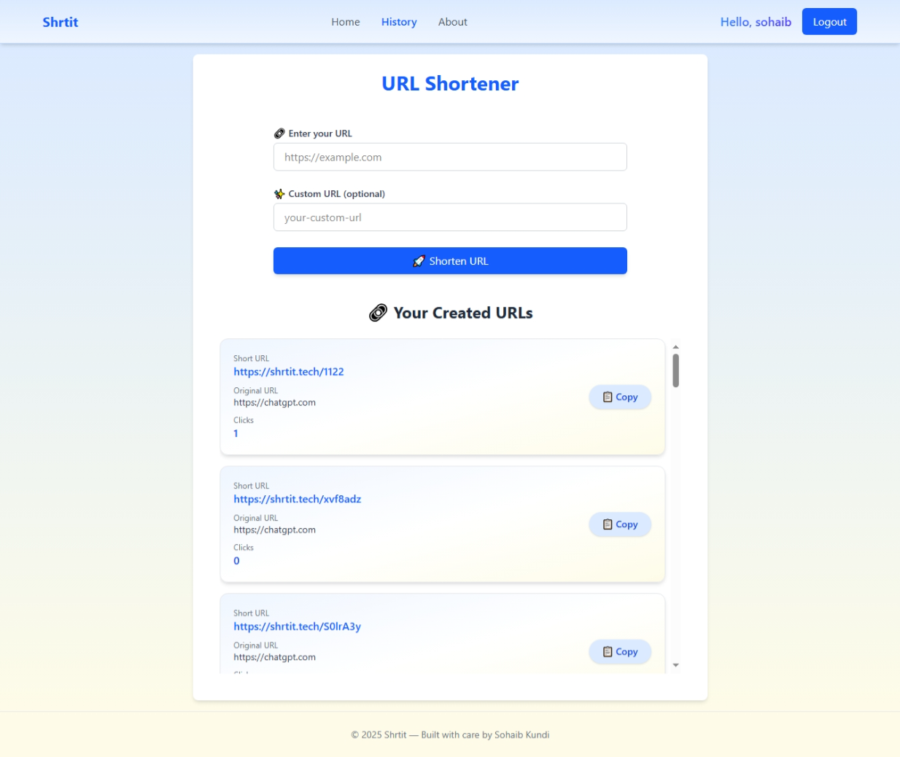
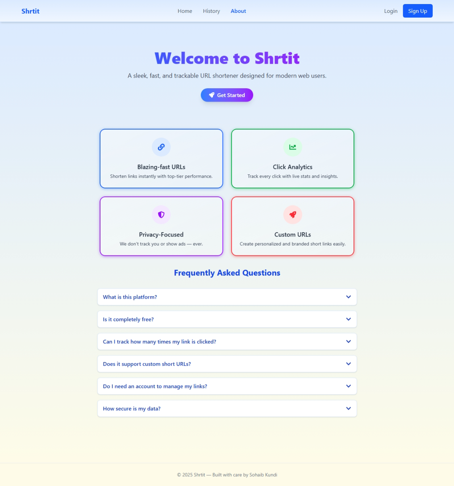

# URL Shortener


A modern full-stack URL shortener built with **React** and **Node.js/Express**. Users can create short links, customize slugs, track visits, and manage their links in a user-friendly dashboard.

---

## Live Demo

* Current Frontend: https://urlchanged.vercel.app
* Current Backend/API: https://url-shortner-eoyu.onrender.com

> Previously deployed on the custom domain **shrtit.tech** with the API hosted at **api.shrtit.tech**. The project has since been migrated to its current Vercel and Render deployment infrastructure.


---

## Features

* Shorten URLs with optional custom slugs
* User authentication with login and registration
* Custom aliases for authenticated users
* Personal dashboard to manage links
* Visit tracking and analytics
* One-click copy to clipboard
* Responsive UI with modern design
* Smooth animations using Framer Motion
* Data synchronization with TanStack React Query

---

## Tech Stack

### Frontend

* React
* Tailwind CSS
* Framer Motion
* TanStack React Query
* Redux Toolkit

### Backend

* Node.js
* Express.js
* MongoDB
* Mongoose

### Authentication

* JWT Authentication
* HttpOnly Cookies

### Deployment

* Frontend: Vercel
* Backend: Render

---

## Getting Started

### Prerequisites

* Node.js
* npm
* MongoDB Atlas or Local MongoDB

### Clone Repository

```bash
git clone https://github.com/Sohaibkundi2/url-shortner.git
cd url-shortner
```

### Backend Setup

```bash
cd BACKEND
npm install
```

Create a `.env` file:

```env
PORT=3000
MONGO_URI=your_mongodb_connection_string
JWT_SECRET=your_secret_key
CLIENT_URL=http://localhost:5173
```

Run backend:

```bash
npm run dev
```

Backend runs at:

```text
http://localhost:3000
```

### Frontend Setup

```bash
cd FRONTEND
npm install
npm run dev
```

Create  `.env` frontend and backend:

```env
frontend:
VITE_API_BASE_URL=http://localhost:3000/
```
```env
backend:
PORT = 3000
MONGO_URI = ...
APP_URL = http://localhost:3000/
JWT_SECRET = ...
```

Frontend runs at:

```text
http://localhost:5173
```

---

## Usage

1. Open the application.
2. Register or log in.
3. Enter a long URL.
4. Optionally create a custom slug.
5. Generate and share your shortened URL.
6. Track link activity from your dashboard.

---

## Screenshots

### Dashboard & About Page

<p align="center">
  
  &nbsp;
  
</p>

---

## Project Structure

```text
url-shortner/
├── BACKEND/
│   ├── controllers/
│   ├── models/
│   ├── routes/
│   └── app.js
│
├── FRONTEND/
│   ├── src/
│   │   ├── api/
│   │   ├── components/
│   │   ├── pages/
│   │   └── App.jsx
│   └── vite.config.js
│
├── README.md
├── CONTRIBUTING.md
├── CODE_OF_CONDUCT.md
└── .gitignore
```

---

## Vercel Configuration

The project uses rewrites to support:

* React client-side routing
* URL slug redirection
* API proxying


---

## Authentication

* JWT-based authentication
* Secure HttpOnly cookies
* Protected frontend and backend routes
* Persistent login sessions

---

## License

This project is intended for educational and portfolio purposes.

---

## Credits

* React
* Express.js
* MongoDB
* Framer Motion
* TanStack Query

---

## Author

**Sohaib Kundi**

Full-Stack Developer | Web Engineer

GitHub: https://github.com/Sohaibkundi2
