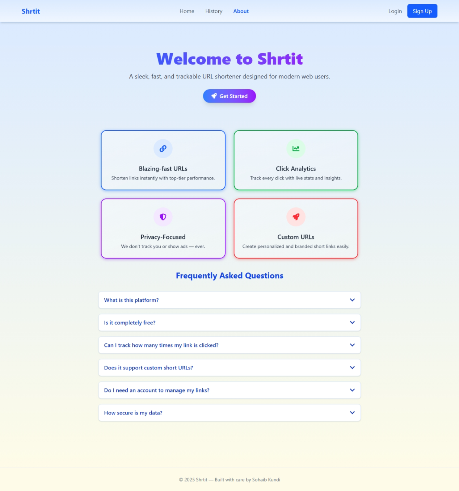

# URL Shortener


A modern full-stack URL shortener built with **React** and **Node.js/Express**. Users can create short links, customize slugs, track visits, and manage their links in a user-friendly dashboard.

---

## Live Demo

- Frontend: [https://shrtit.tech](https://shrtit.tech)
- Backend/API: [https://api.shrtit.tech](https://api.shrtit.tech)

> Note: The backend was originally deployed on Railway, but has since been migrated to Render for better domain and SSL support.

---

## Features

- Shorten URLs with optional custom slugs
- User authentication with login and registration
- Personal dashboard to manage and track links
- Real-time click tracking with statistics
- One-click copy to clipboard
- Smooth transitions with Framer Motion
- Data synchronization via TanStack React Query

---

## Tech Stack

- **Frontend**: React, Tailwind CSS, Framer Motion, React Query
- **Backend**: Node.js, Express, MongoDB
- **Authentication**: JWT (HttpOnly cookies)
- **Deployment**: Vercel (Frontend), Render (Backend)

---

## Getting Started (Local Setup)

### Prerequisites

- Node.js and npm
- MongoDB (local or [MongoDB Atlas](https://www.mongodb.com/cloud/atlas))

### 1. Clone the Repository

```bash
git clone https://github.com/sohaibkundi2/url-shortener.git
cd url-shortener
```

### 2. Backend Setup

```bash
cd backend
npm install
```

Create a `.env` file in the `backend` folder:

```env
PORT=3000
MONGO_URI=your_mongodb_connection_string
JWT_SECRET=your_secret_key
CLIENT_URL=http://localhost:5173
```

Start the backend server:

```bash
npm run dev
```

The backend will run on: `http://localhost:3000`

### 3. Frontend Setup

```bash
cd ../frontend
npm install
npm run dev
```
- #### Also change 
```
// in UrlForm.jsx

const BASE_URL = "api.shrtit.tech";
to 
const BASE_URL = http://localhost:3000

// And UserUrl.jsx

const BASE_URL = "https://shrtit.tech/";
to
const BASE_URL = "http://localhost:3000";
```

The frontend will run on: `http://localhost:5173`

---

## Usage

- Go to [shrtit.tech](https://shrtit.tech)
- Register or log in to your account
- Create short URLs with optional custom aliases
- Share links and monitor visit stats on your dashboard
- All data syncs automatically using React Query

---
 ## Screenshots
- 🔹 Dashboard
- 🔹 About Page
<p align="center">
  
  &nbsp;
  
</p>

## Project Structure

```
url-shortener/
├── backend/
│   ├── controllers/
│   ├── models/
│   └── app.js
├── frontend/
│   ├── src/
│   │   ├── api/
│   │   ├── components/
│   │   └── App.jsx
│   └── index.html
│   └── vite.config.js
├── README.md
├── CONTRIBUTING.md
├── CODE_OF_CONDUCT.md
└── .gitignore
```

---

## Vercel Configuration

To enable client-side routing with React on Vercel, the following is included in `vercel.json`:

```json
{
  "rewrites": [
    { "source": "/(.*)", "destination": "/" }
  ]
}
```

This ensures routes like `/auth` or `/dashboard` do not return 404 on refresh.

---

## Authentication

- JWT-based authentication
- Tokens are stored in secure HttpOnly cookies
- Protected routes implemented on both frontend and backend

---
## 💖 Support This Project
If you find this project helpful or interesting, please consider supporting it:

- [Github Sponsors](https://github.com/sponsors/Sohaibkundi2)
- [Open Collective](https://opencollective.com/shrtittech)

## License

This project is intended for educational and demonstration purposes only.

---

## Credits

- [React](https://react.dev/)
- [Express](https://expressjs.com/)
- [MongoDB](https://www.mongodb.com/)
- [Framer Motion](https://www.framer.com/motion/)
- [TanStack Query](https://tanstack.com/query/latest)

---

## Author

```
Made by Sohaib Kundi
Full-Stack Developer | Web Engineer  
```